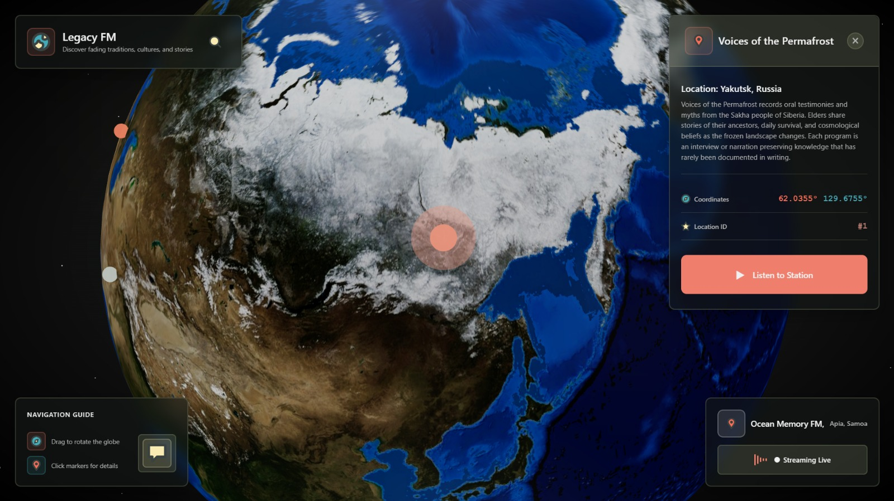

# LegacyFM

**Radio stations for the world's fading cultures.** Spin the globe, tune in to a station, and listen to an AI presenter tell the stories of a culture or tradition at risk of being forgotten, alongside everyone else who is listening at that moment.

🏆 **DurHack X: 3rd place overall (530+ participants) and [MLH] Best Use of ElevenLabs**

[Devpost](https://devpost.com/software/legacyfm) · [Demo video](https://www.youtube.com/watch?v=g-2Cx0CHjsE)



## What it does

- **Stations on a globe.** Each station belongs to a fading culture, tradition or story.
- **AI-presented shows.** An LLM writes each presenter's script and ElevenLabs text-to-speech voices it.
- **Truly live radio.** Audio is synchronised across clients, so every listener on a station hears the same moment of the broadcast.
- **Shared listening.** Listeners can send messages and reactions in real time, visible to everyone tuned in.

## How it works

LegacyFM is a three-tier TypeScript application.

| Part | Stack | Role |
|---|---|---|
| `frontend/` | React, Vite, TalkJS | Globe, station player, live chat and reactions |
| `backend/` | Fastify, PostgreSQL, Redis | Station data, script generation, audio streaming |
| `shared/` | TypeScript | DTOs that define the contract between frontend and backend |

Scripts are generated through OpenRouter and voiced with ElevenLabs. Sharing DTOs between the two sides let the team split work cleanly and reach a working MVP within the first four hours of the hackathon.

### Synchronised audio streaming

The hardest problem was making the stream behave like radio and not like a file each listener plays from the start. The backend tracks each station's broadcast position and serves audio from that byte offset, so a listener who joins late lands at the same point as everyone else. Each station holds a single pre-generated WAV buffer in memory along with the wall-clock time it started playing. When a client connects, the server computes the current playback position as (now - startTime) % duration, slices the buffer at that offset, prepends a fresh WAV header, and streams the remainder back as chunked audio. Because every request derives its position from the same shared clock, all listeners stay synchronized to one server-side timeline regardless of when they join.

## Running locally

**Requirements:** 

Node.js 20+ and npm. 

```bash
git clone https://github.com/VladP812/LegacyFM.git
cd LegacyFM

# Install dependencies in each package
(cd shared && npm install)
(cd backend && npm install)
(cd frontend && npm install)

# Environment files
touch backend/.env.development
echo "VITE_BACKEND_URL=http://localhost:11337" > frontend/.env.development
```
Define the following env values in the /backend/.env.development:
```
OPENROUTER_API_KEY=...
ELEVENLABS_API_KEY=...
DB_HOST=...
DB_PORT=...
DB_USER=...
DB_PASSWORD=...
DB_DATABASE=...
```

Then start both servers in separate terminals:

```bash
cd backend && npm run dev
```

```bash
cd frontend && npm run dev
```

Open http://localhost:5173.

## Team

Built in 24 hours at DurHack X by:

- [**Vlad Ponomarev**](https://github.com/VladP812): live audio streaming and synchronisation.
- [**Jamie Wylie**](https://github.com/Wyliemaster): radio station searching
- [**Sebastian Clarke**](https://github.com/Thelegendseb): frontend

## What's next

- More advanced station search
- Station recommendations tied to cultural days and festivals
